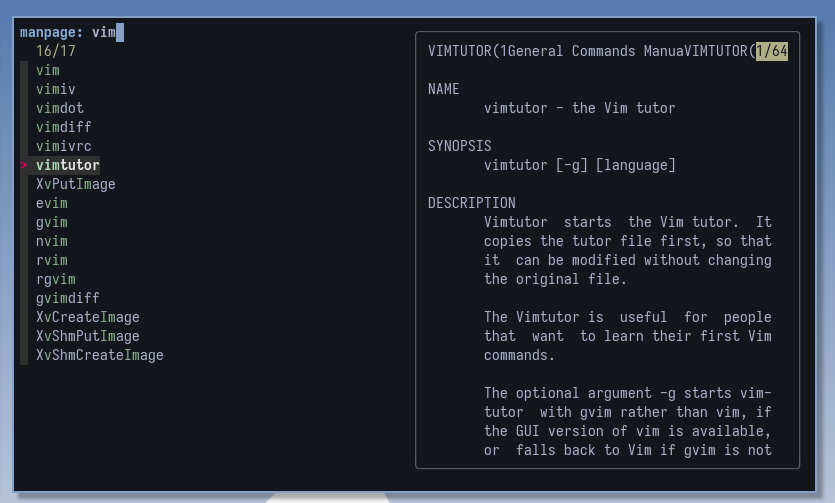

# 📖 fzman

*fzman* is a manpage finder with `fzf` written in simple shell script.



## Usage

```
fzman -- manpage finder with fzf

USAGE
    fzman KEYWORDS...
    fzman [OPTIONS]

OPTIONS
    -h, --help          Show this help message and exit
    --version           Show version information and exit
```

## Installation

### Dependence

Requires <a href="https://github.com/junegunn/fzf">junegunn/fzf</a> .

### Install fzman

```bash
cd fzman
sudo make install
```

### Manual Installation

```bash
curl -O https://raw.githubusercontent.com/sheepla/fzman/main/fzman && chmod +x fzman
# or wget
```
